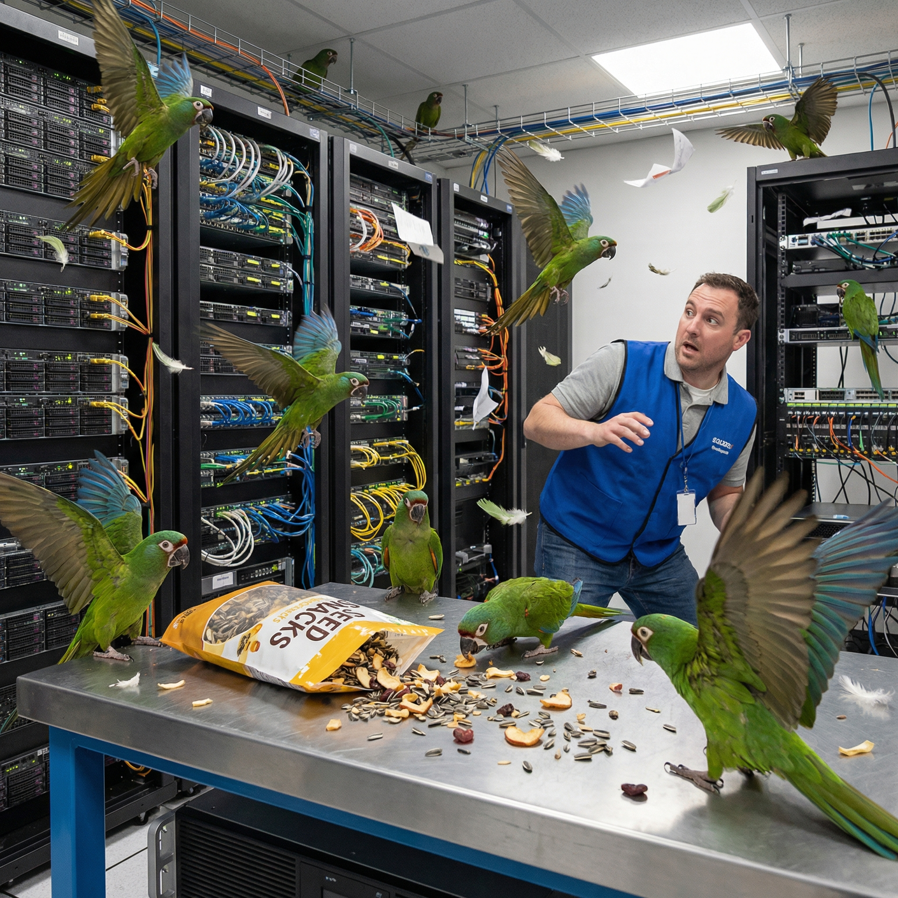

# macaw

domain registration backend

## Initial Requirements

- works with OpenSRS API
- cache in a database
- handle multiple customers
- compatible with Authelia
- write server in Rust with sea-orm
- maintain audit journal of all domain changes
- handle billing
- contact information updates
- clean interface, no ads

Eventually I'd like to implement most of
[these features](https://github.com/fini-net/macaw/pull/3#issuecomment-3753022343).

## Contributing

- [Code of Conduct](.github/CODE_OF_CONDUCT.md)
- [Contributing Guide](.github/CONTRIBUTING.md) includes a step-by-step guide to our
  [development process](.github/CONTRIBUTING.md#development-process).

## Support & Security

- [Getting Support](.github/SUPPORT.md)
- [Security Policy](.github/SECURITY.md)
