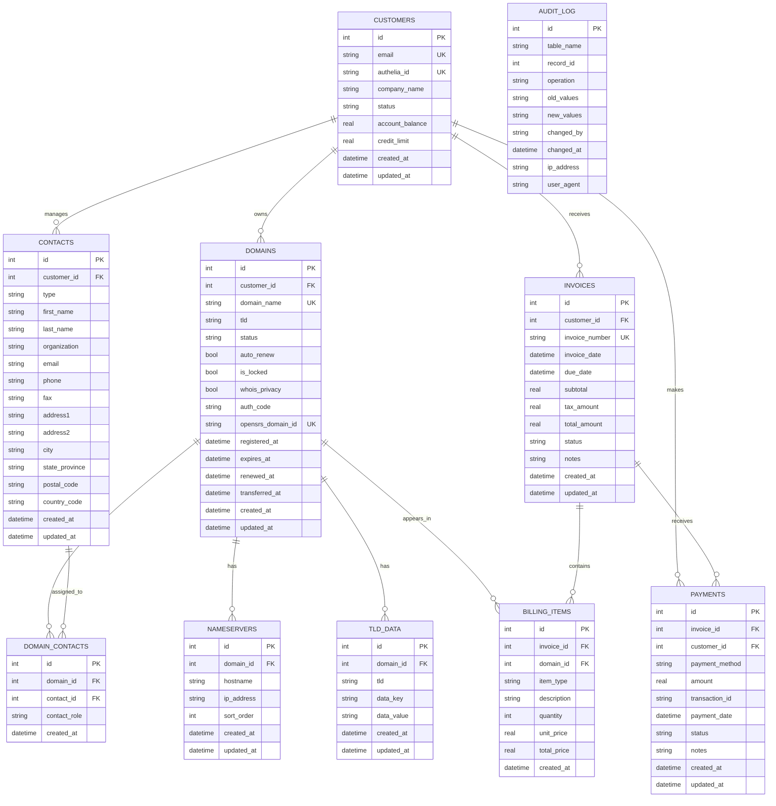

# Entity Relationship Diagram (ERD)

## Visual Representation

## Relationship Details

### One-to-Many Relationships

1. **CUSTOMERS → DOMAINS**
   - One customer can own multiple domains
   - Foreign Key: `domains.customer_id` → `customers.id`
   - Delete: RESTRICT (cannot delete customer with domains)

2. **CUSTOMERS → CONTACTS**
   - One customer can manage multiple contacts
   - Foreign Key: `contacts.customer_id` → `customers.id`
   - Delete: CASCADE (delete contacts when customer is deleted)

3. **CUSTOMERS → INVOICES**
   - One customer can have multiple invoices
   - Foreign Key: `invoices.customer_id` → `customers.id`
   - Delete: RESTRICT (cannot delete customer with invoices)

4. **CUSTOMERS → PAYMENTS**
   - One customer can make multiple payments
   - Foreign Key: `payments.customer_id` → `customers.id`
   - Delete: RESTRICT (preserve payment history)

5. **DOMAINS → NAMESERVERS**
   - One domain can have multiple nameservers
   - Foreign Key: `nameservers.domain_id` → `domains.id`
   - Delete: CASCADE (delete nameservers when domain is deleted)

6. **DOMAINS → TLD_DATA**
   - One domain can have multiple TLD-specific data entries
   - Foreign Key: `tld_data.domain_id` → `domains.id`
   - Delete: CASCADE (delete TLD data when domain is deleted)

7. **INVOICES → BILLING_ITEMS**
   - One invoice can contain multiple billing items
   - Foreign Key: `billing_items.invoice_id` → `invoices.id`
   - Delete: CASCADE (delete items when invoice is deleted)

8. **INVOICES → PAYMENTS**
   - One invoice can receive multiple payments (partial payments)
   - Foreign Key: `payments.invoice_id` → `invoices.id`
   - Delete: RESTRICT (preserve payment history)

9. **DOMAINS → BILLING_ITEMS**
   - One domain can appear in multiple billing items
   - Foreign Key: `billing_items.domain_id` → `domains.id`
   - Delete: SET NULL (preserve billing history)

### Many-to-Many Relationships

1. **DOMAINS ↔ CONTACTS** (via DOMAIN_CONTACTS)
   - One domain can have multiple contacts (registrant, admin, tech, billing)
   - One contact can be used for multiple domains
   - Junction Table: `domain_contacts`
   - Constraint: UNIQUE(domain_id, contact_role) ensures one contact per role per domain
   - Delete:
     - CASCADE from domain (remove assignments when domain deleted)
     - RESTRICT from contact (prevent deletion of contacts in use)

## Cardinality Summary

| Relationship | Type | Cardinality |
|--------------|------|-------------|
| Customers → Domains | 1:N | 1 customer : 0..* domains |
| Customers → Contacts | 1:N | 1 customer : 0..* contacts |
| Customers → Invoices | 1:N | 1 customer : 0..* invoices |
| Customers → Payments | 1:N | 1 customer : 0..* payments |
| Domains → Nameservers | 1:N | 1 domain : 0..* nameservers |
| Domains → TLD Data | 1:N | 1 domain : 0..* tld_data |
| Domains → Billing Items | 1:N | 1 domain : 0..* billing_items |
| Invoices → Billing Items | 1:N | 1 invoice : 1..* billing_items |
| Invoices → Payments | 1:N | 1 invoice : 0..* payments |
| Domains ↔ Contacts | M:N | * domains : * contacts (via domain_contacts) |

## Key Constraints

### Unique Constraints
- `customers.email` - Email must be unique across all customers
- `customers.authelia_id` - Authelia ID must be unique
- `domains.domain_name` - Domain name must be unique globally
- `domains.opensrs_domain_id` - OpenSRS ID must be unique
- `invoices.invoice_number` - Invoice number must be unique
- `domain_contacts(domain_id, contact_role)` - One contact per role per domain
- `tld_data(domain_id, data_key)` - One value per key per domain

### Check Constraints
- `customers.status` ∈ {active, suspended, closed}
- `contacts.type` ∈ {registrant, admin, technical, billing}
- `domains.status` ∈ {pending, active, expired, grace, redemption, pending_delete, transferred_away, cancelled}
- `domains.auto_renew` ∈ {0, 1}
- `domains.is_locked` ∈ {0, 1}
- `domains.whois_privacy` ∈ {0, 1}
- `domain_contacts.contact_role` ∈ {registrant, admin, technical, billing}
- `invoices.status` ∈ {draft, sent, paid, overdue, cancelled, refunded}
- `billing_items.item_type` ∈ {registration, renewal, transfer, whois_privacy, other}
- `payments.payment_method` ∈ {credit_card, bank_transfer, paypal, credit, other}
- `payments.status` ∈ {pending, completed, failed, refunded}
- `audit_log.operation` ∈ {INSERT, UPDATE, DELETE}

## Indexes

### Primary Indexes (Automatic)
- All `id` columns are indexed as primary keys

### Foreign Key Indexes
- `contacts.customer_id`
- `domains.customer_id`
- `domain_contacts.domain_id`
- `domain_contacts.contact_id`
- `nameservers.domain_id`
- `invoices.customer_id`
- `billing_items.invoice_id`
- `billing_items.domain_id`
- `payments.invoice_id`
- `payments.customer_id`
- `tld_data.domain_id`

### Unique Indexes
- `customers.email`
- `customers.authelia_id`
- `domains.domain_name`
- `domains.opensrs_domain_id`
- `invoices.invoice_number`

### Query Optimization Indexes
- `customers.status` - Filter active customers
- `contacts.type` - Filter by contact type
- `contacts.email` - Search by email
- `domains.status` - Filter by domain status
- `domains.expires_at` - Find expiring domains
- `domains.tld` - Filter by TLD
- `domains(customer_id, status)` - Composite for customer's active domains
- `domain_contacts.contact_role` - Filter by role
- `nameservers.hostname` - Search nameservers
- `invoices.status` - Filter by invoice status
- `invoices.due_date` - Find overdue invoices
- `invoices(customer_id, status)` - Composite for customer's unpaid invoices
- `billing_items.item_type` - Filter by item type
- `payments.payment_date` - Date range queries
- `payments.status` - Filter by payment status
- `tld_data.tld` - Filter by TLD
- `tld_data.data_key` - Search by key
- `audit_log(table_name, record_id)` - Composite for record history
- `audit_log.changed_at` - Date range queries
- `audit_log.changed_by` - Filter by user

## Notes

- **PK** = Primary Key
- **FK** = Foreign Key
- **UK** = Unique Key
- All datetime fields use ISO 8601 format
- Boolean fields stored as INTEGER (0/1) for SQLite compatibility
- Audit log table has no foreign keys to prevent deletion cascades
